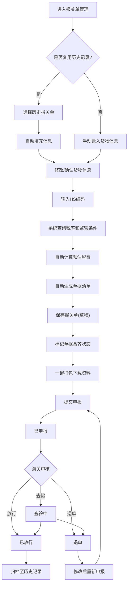

## 1. 产品概述

进出口货物报关辅助管理系统，面向中小贸易企业，提供从货物信息录入、税费预估、单据管理、报关进度跟踪到历史归档的全流程报关辅助服务，降低报关操作复杂度，提升通关效率。

- 解决中小企业报关流程繁琐、税费计算不透明、单据管理混乱的核心痛点
- 帮助企业实现报关流程数字化，减少人工差错，提高财务预算准确性

## 2. 核心功能

### 2.1 用户角色
| 角色 | 注册方式 | 核心权限 |
|------|----------|----------|
| 管理员 | 系统分配 | 全部功能、用户管理、数据导出 |
| 操作员 | 管理员创建 | 货物录入、单据管理、进度更新 |
| 财务人员 | 管理员创建 | 税费查看、统计分析、预算报表 |

### 2.2 功能模块
1. **工作台首页**：关键指标卡片、近期报关动态、月度趋势速览
2. **报关单管理**：货物信息录入、HS编码查询、税费预估、报关单列表
3. **单据中心**：单据清单自动生成、备齐状态标记、资料包一键打包下载
4. **进度跟踪**：报关状态流转、时间线记录、状态变更通知
5. **历史归档**：按客户/货物类型归档、快速复用历史申报
6. **统计分析**：月度进出口批次趋势、税费金额趋势、财务预算辅助

### 2.3 页面详情
| 页面名称 | 模块名称 | 功能描述 |
|----------|----------|----------|
| 工作台首页 | 指标卡片 | 显示本月进出口批次、待处理报关单、应缴税款总额、放行率 |
| 工作台首页 | 近期动态 | 最近10条报关状态变更记录，含时间和操作人 |
| 工作台首页 | 趋势速览 | 近6个月进出口批次与税费迷你趋势图 |
| 报关单管理-列表 | 筛选与搜索 | 按状态、日期范围、客户、进出口类型筛选；支持HS编码/品名搜索 |
| 报关单管理-列表 | 报关单表格 | 展示报关单号、品名、HS编码、申报价值、状态、创建时间；支持排序 |
| 报关单管理-录入 | 货物信息表单 | 录入品名、HS编码、数量、单位、申报价值、币种、原产地、进出口类型 |
| 报关单管理-录入 | HS编码查询 | 输入HS编码自动查询对应税率（关税、增值税、消费税）和监管条件 |
| 报关单管理-录入 | 税费预估 | 根据HS编码税率和申报价值自动计算预估应缴关税、增值税、消费税 |
| 报关单管理-录入 | 快速复用 | 从历史归档中选择相同品类报关单，自动填充货物信息 |
| 单据中心 | 单据清单 | 根据货物类型和HS编码自动生成所需单据清单（发票、装箱单、合同、产地证等） |
| 单据中心 | 备齐状态 | 逐项标记单据备齐状态（未准备/准备中/已备齐），显示完成进度 |
| 单据中心 | 资料包打包 | 一键打包所有已备齐单据为ZIP下载，报关行资料包模板化 |
| 进度跟踪 | 状态看板 | 看板视图展示各报关单当前状态（草稿/已申报/查验中/已放行/退单） |
| 进度跟踪 | 状态时间线 | 每个报关单的状态变更时间线，记录每次状态变更的时间和操作人 |
| 进度跟踪 | 状态更新 | 操作按钮更新报关状态，自动记录变更时间 |
| 历史归档 | 归档列表 | 按客户和货物类型分类的历史报关记录列表 |
| 历史归档 | 快速复用 | 选择历史记录一键创建新报关单，自动填充货物和单据信息 |
| 历史归档 | 归档详情 | 查看完整报关记录详情，含所有货物信息、税费、单据和进度记录 |
| 统计分析 | 月度趋势图 | 各月进出口批次数趋势折线图 |
| 统计分析 | 税费趋势图 | 各月关税、增值税、消费税金额趋势图 |
| 统计分析 | 财务预算 | 基于历史数据的季度税费预测，辅助财务预算编制 |
| 统计分析 | 分类统计 | 按货物类型、原产地、客户维度的分类统计 |

## 3. 核心流程

**报关单创建流程**：用户进入报关单管理页面 → 点击新建报关单 → 可选择从历史记录复用或手动录入 → 填写货物信息（品名、HS编码、数量、申报价值、原产地） → 系统根据HS编码自动查询税率和监管要求 → 系统计算预估应缴税款 → 自动生成单据清单 → 保存为草稿状态

**报关进度流转流程**：报关单草稿 → 提交申报（已申报）→ 海关审核（查验中）→ 审核通过（已放行）/ 审核不通过（退单）→ 每次状态变更自动记录时间和操作人

## 4. 用户界面设计

### 4.1 设计风格
- **主色调**：深海蓝(#0F2B46) + 暖金(#C8A45C) 点缀，体现国际贸易的专业与信赖感
- **辅助色**：浅灰蓝(#E8EDF2)背景、白色卡片、状态色（绿-放行/橙-查验/红-退单/蓝-已申报）
- **按钮风格**：圆角6px，主按钮深蓝底金色文字，次按钮描边风格
- **字体**：标题使用 Noto Serif SC（衬线，体现权威感），正文使用 Noto Sans SC（清晰易读）
- **布局风格**：左侧固定导航 + 右侧内容区，卡片式布局，信息密度适中
- **图标风格**：线性图标，2px描边，与整体专业调性一致

### 4.2 页面设计概览
| 页面名称 | 模块名称 | UI元素 |
|----------|----------|--------|
| 工作台首页 | 指标卡片 | 四宫格卡片，深蓝渐变背景，金色数字，白色标签；入场渐显动画 |
| 工作台首页 | 近期动态 | 白色卡片，时间线列表，状态标签带颜色编码，左侧色条指示 |
| 工作台首页 | 趋势速览 | 白色卡片内嵌迷你图表，渐变面积图，金色线条 |
| 报关单管理-列表 | 筛选栏 | 白色筛选区域，下拉选择+日期范围+搜索框，蓝色提交按钮 |
| 报关单管理-列表 | 数据表格 | 白色表格，斑马纹行，状态徽章，悬浮行高亮 |
| 报关单管理-录入 | 信息表单 | 白色卡片分区，标签左对齐，输入框下边框样式，金色焦点边框 |
| 报关单管理-录入 | 税费面板 | 右侧粘性面板，深蓝背景，金色金额数字，税费分项列表 |
| 单据中心 | 清单卡片 | 白色卡片，每项带复选框和状态标签，进度条显示完成度 |
| 单据中心 | 打包按钮 | 金色主按钮，点击后进度动画，完成后下载图标 |
| 进度跟踪 | 状态看板 | 横向看板列，每列一个状态，卡片在列间拖拽视觉感 |
| 进度跟踪 | 时间线 | 垂直时间线，左侧时间戳，右侧状态描述，连接线渐变色 |
| 历史归档 | 归档列表 | 卡片网格布局，客户名+品类标签，悬浮显示复用按钮 |
| 统计分析 | 图表区域 | 白色大卡片，深色图表，金色强调线，图例右上角 |

### 4.3 响应式设计
- 桌面优先设计，1920px/1440px为主要断点
- 平板端(768px-1024px)：侧边栏折叠为图标模式，表格横向滚动
- 移动端(<768px)：侧边栏完全隐藏为抽屉，卡片单列堆叠

### 4.4 3D场景指引
- 不适用
