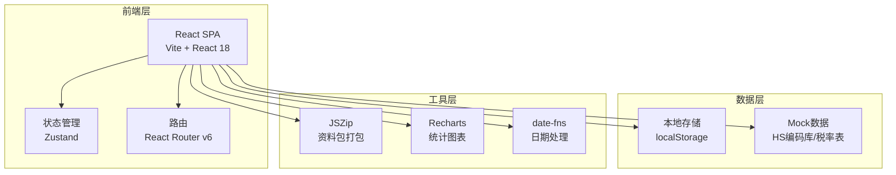
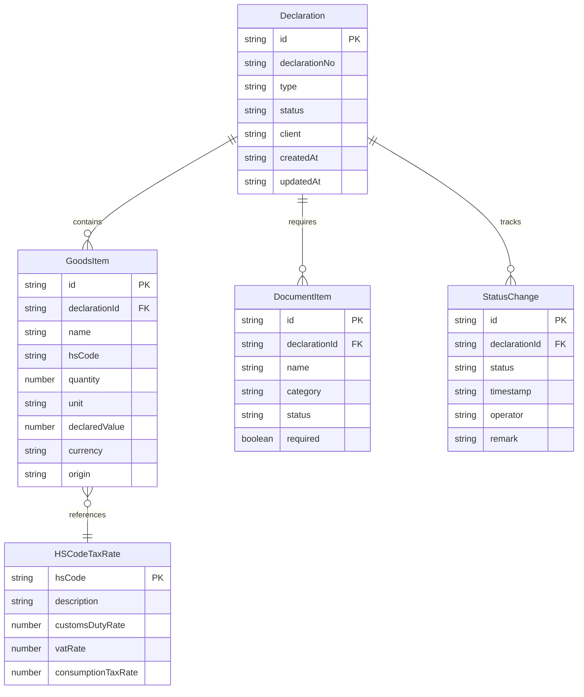

## 1. 架构设计



## 2. 技术说明
- **前端**：React@18 + TailwindCSS@3 + Vite
- **初始化工具**：Vite (React + TypeScript 模板)
- **后端**：无后端，纯前端应用，使用 localStorage 持久化数据
- **数据库**：使用 localStorage + 内置 Mock 数据（HS编码税率库、单据模板库）

## 3. 路由定义
| 路由 | 用途 |
|------|------|
| / | 工作台首页，展示关键指标和动态 |
| /declarations | 报关单列表，筛选、搜索和管理 |
| /declarations/new | 新建报关单，录入货物信息 |
| /declarations/:id | 报关单详情，含税费、单据和进度 |
| /documents | 单据中心，单据清单管理和打包下载 |
| /tracking | 进度跟踪，状态看板和时间线 |
| /archive | 历史归档，按客户和品类归档 |
| /statistics | 统计分析，趋势图和财务预算 |

## 4. API定义
本项目为纯前端应用，不涉及后端API。数据通过以下方式管理：

### 4.1 数据存储接口
```typescript
interface Declaration {
  id: string
  declarationNo: string
  type: 'import' | 'export'
  status: 'draft' | 'submitted' | 'inspecting' | 'released' | 'rejected'
  goods: GoodsItem[]
  totalEstimatedTax: TaxBreakdown
  documents: DocumentItem[]
  progressHistory: StatusChange[]
  client: string
  createdAt: string
  updatedAt: string
}

interface GoodsItem {
  id: string
  name: string
  hsCode: string
  quantity: number
  unit: string
  declaredValue: number
  currency: string
  origin: string
  taxRate: HSCodeTaxRate
}

interface HSCodeTaxRate {
  hsCode: string
  description: string
  customsDutyRate: number
  vatRate: number
  consumptionTaxRate: number
  supervisionConditions: string[]
}

interface TaxBreakdown {
  customsDuty: number
  vat: number
  consumptionTax: number
  total: number
}

interface DocumentItem {
  id: string
  name: string
  category: string
  status: 'not_prepared' | 'preparing' | 'ready'
  required: boolean
  description: string
}

interface StatusChange {
  status: Declaration['status']
  timestamp: string
  operator: string
  remark: string
}
```

## 5. 服务端架构图
不适用（纯前端应用）

## 6. 数据模型

### 6.1 数据模型定义


### 6.2 数据定义语言
使用 localStorage 存储，数据结构如下：

- `declarations`: Declaration[] — 所有报关单
- `hsCodeDB`: HSCodeTaxRate[] — HS编码税率库（内置Mock数据）
- `documentTemplates`: Record<string, DocumentItem[]> — 按货物类型的单据模板库
- `archive`: Declaration[] — 已归档的历史报关记录

初始Mock数据包含：
- 30条HS编码税率记录（覆盖常见进出口品类）
- 8种货物类型对应的单据模板
- 20条历史报关记录样例（用于统计和复用演示）
